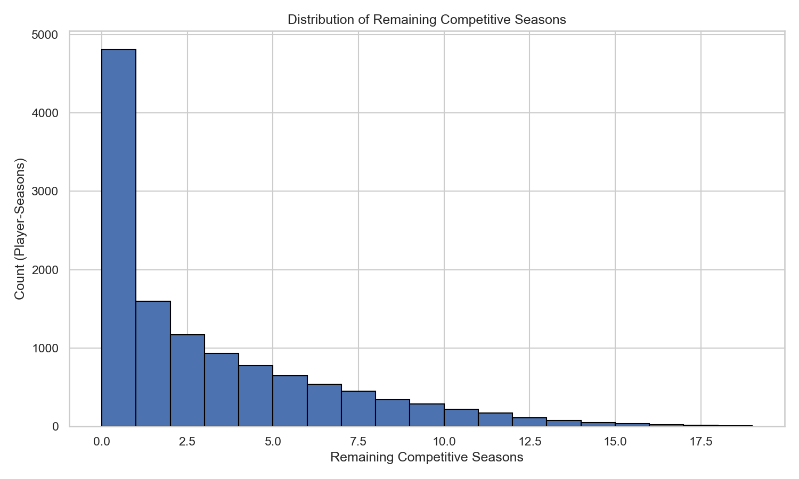
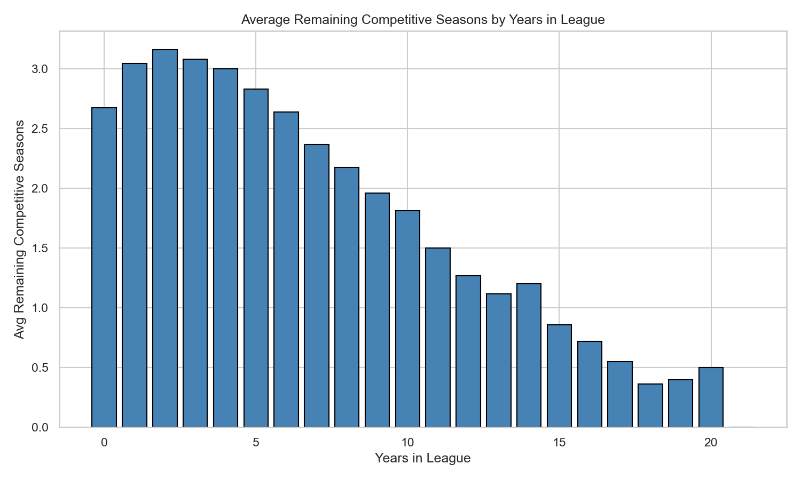
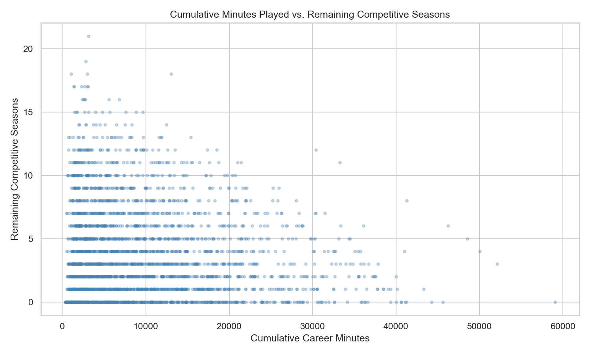
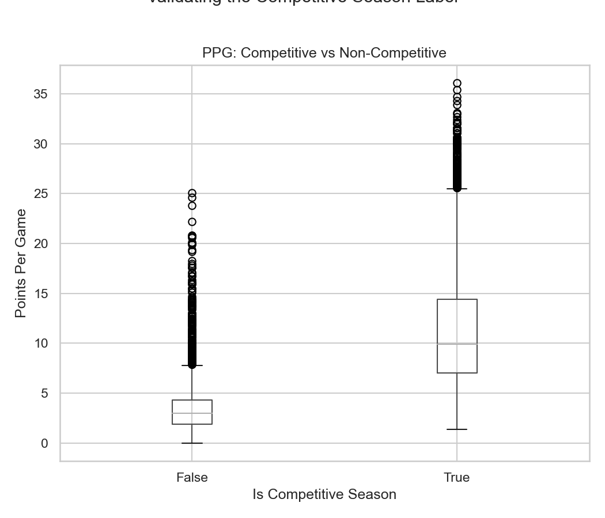
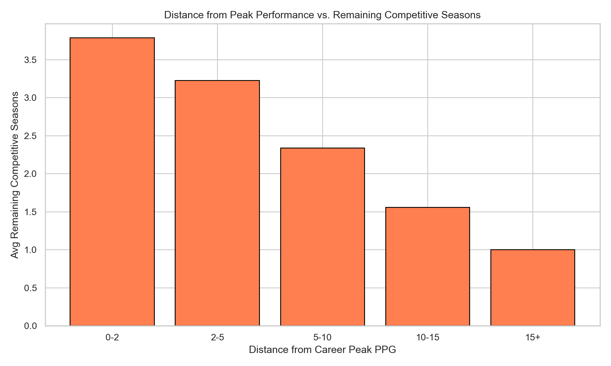
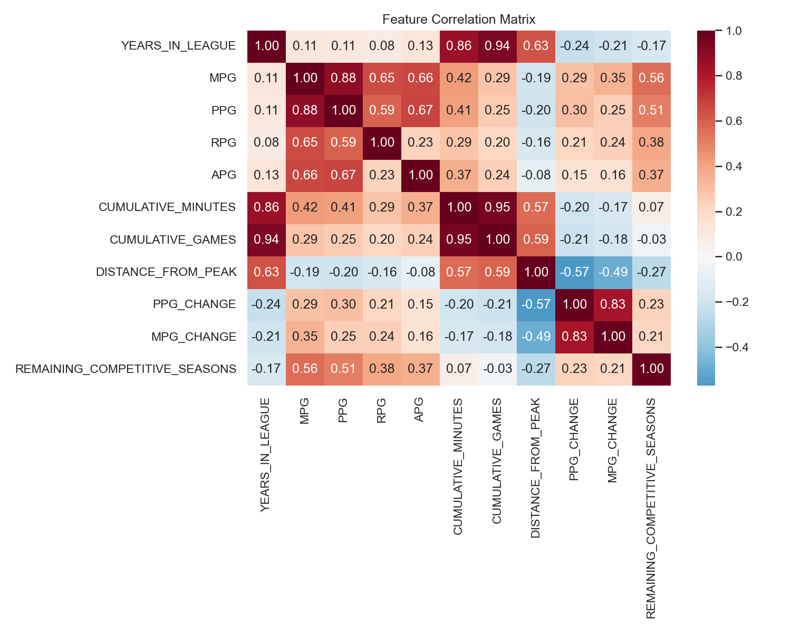
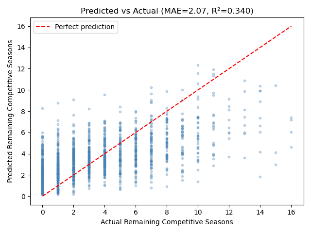
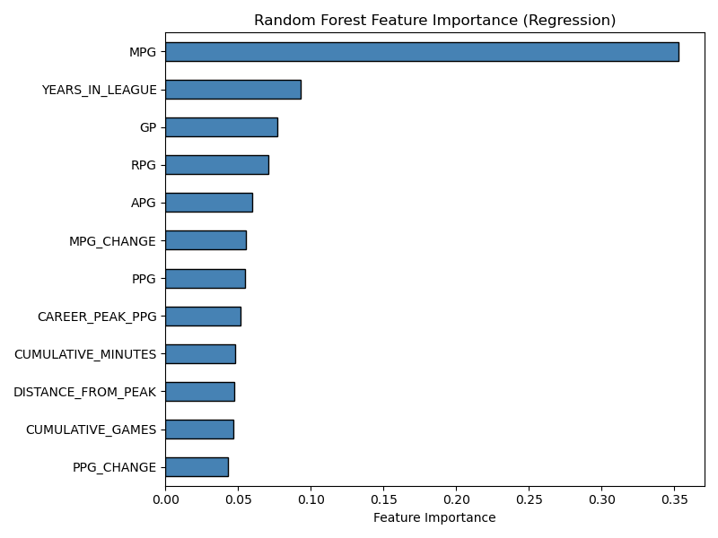
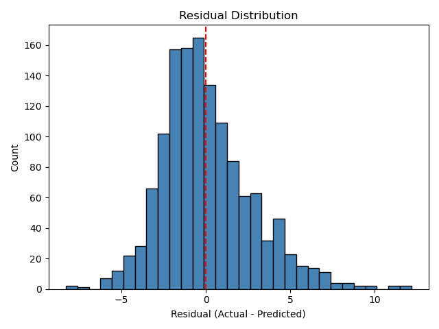
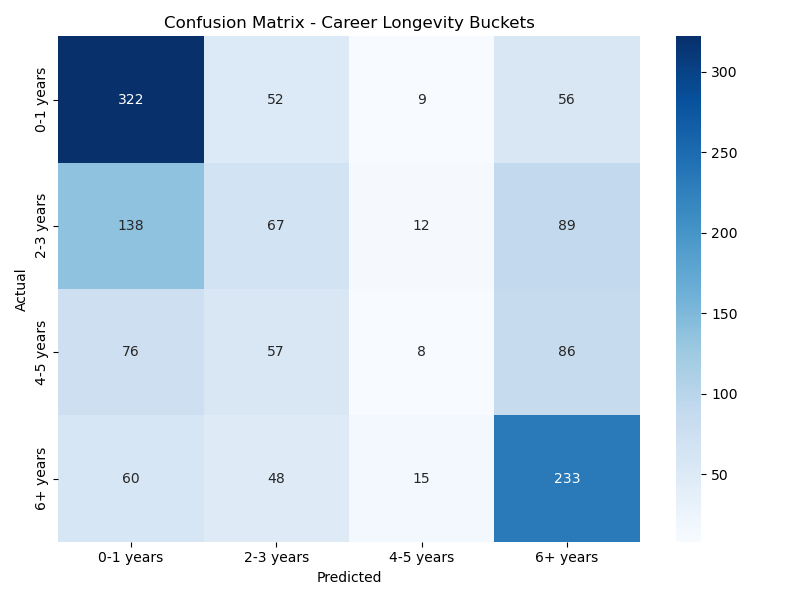

# NBA Career Longevity Predictor

## Description

This project builds a system that predicts how many **competitive seasons** an NBA player has remaining in their career. Using historical player statistics and advanced metrics pulled from the NBA API, the model estimates a player's remaining competitive window — defined as seasons where they maintain meaningful on-court contributions.

## Local Build Instructions

In the root directory, run:

```bash
make all
```

This will run the full pipeline:
1. `make data` — fetches NBA stats from 2000–2024 via the `nba_api` library and saves `nba_career_longevity_data.csv`
2. `make visualizations` — generates all plots into the `plots/` directory
3. `make model` — trains the Random Forest models and prints evaluation metrics

To clean all generated files:

```bash
make clean
```

**Dependencies:** Install required packages with:

```bash
pip install pandas numpy matplotlib seaborn scikit-learn nba_api
```

## Data Processing

### Data Source and Collection

Data is pulled from the official NBA Stats API using the `nba_api` Python package. For each season from 2000–2024, we fetch two types of stats:

- **Base stats** — GP, MPG, PPG, RPG, APG
- **Advanced stats** — PIE (Player Impact Estimate)

These are merged with `PLAYER_ID` per season. I had to use a 1 second delay between API requests to avoid rate limiting, as often it would get stuck after 20% or so of data was collected. This results in a dataset of player's season records across 25 seasons.

### Defining a Competitive Season

A season is labeled **competitive** if the player meets all three thresholds:

| Threshold | Value | Reasoning |
|---|---|---|
| MPG ≥ 15 | Minutes per game | Filters out garbage-time players |
| GP ≥ 20 | Games played | Filters out seasons with injury/barely any usage |
| PIE ≥ 0.07 | Player Impact Estimate | Filters out players with near negligible contribution |

These thresholds were chosen to determine seasons where a player is a genuine contributor to their team, as opposed to simply being on the roster.

### Target Variable

The target variable is `REMAINING_COMPETITIVE_SEASONS`. For each player-season row, how many more competitive seasons does that player go on to have. This is computed as:

```
total career competitive seasons − cumulative competitive seasons up to current row
```

This framing is more meaningful than raw years in league because a player can remain on an NBA roster without meaningfully contributing or even playing.

### Feature Engineering

The model uses 13 features: 6 raw per-game stats pulled directly from the API, and 7 features engineered from those stats.

**Raw stats (used directly as features):**

| Feature | Description |
|---|---|
| `GP` | Games played |
| `MPG` | Minutes per game |
| `PPG` | Points per game |
| `RPG` | Rebounds per game |
| `APG` | Assists per game |
| `PIE` | Player Impact Estimate (advanced stat) |

**Engineered features:**

| Feature | Description |
|---|---|
| `YEARS_IN_LEAGUE` | Seasons since rookie year — captures career stage |
| `CUMULATIVE_MINUTES` | Total career minutes played — captures physical wear/mileage |
| `CUMULATIVE_GAMES` | Total career games played |
| `CAREER_PEAK_PPG` | Highest PPG season recorded so far in career |
| `DISTANCE_FROM_PEAK` | `CAREER_PEAK_PPG − current PPG` — captures scoring decline trajectory |
| `PPG_CHANGE` | Season-over-season change in PPG |
| `MPG_CHANGE` | Season-over-season change in MPG — captures role changes (possible shift to starter/bench etc.) |

Rows with NaN values in any feature are dropped. This primarily affected each player's rookie season, which has no prior season to compute change features from.

## Data Modeling Methods

Two Random Forest models are trained using `scikit-learn`.

### Approach 1: Regression

A **Random Forest Regressor** predicts the exact number of remaining competitive seasons as a continuous value.

```python
RandomForestRegressor(n_estimators=100, max_depth=10, random_state=42)
```

- `max_depth=10` caps tree depth to prevent overfitting to individual player career paths
- Evaluated on an 80/20 train/test split with MAE, RMSE, and R²
- Further validated with 5-fold cross-validation to confirm generalization

### Approach 2: Classification

A **Random Forest Classifier** buckets players into four career longevity categories:

| Bucket | Meaning |
|---|---|
| `0–1 years` | End of career |
| `2–3 years` | Late career |
| `4–5 years` | Mid career |
| `6+ years` | Prime / early career |

```python
RandomForestClassifier(n_estimators=100, max_depth=10, random_state=42)
```

Evaluated with per-class precision, recall, F1, and a confusion matrix.

**Why Use Random Forest?**
- Career decline is not linear, a player can plateau for years before a sharp dropoff
- Naturally handles interactions between features (e.g., high cumulative minutes + declining MPG = career ends faster)
- Provides feature importance rankings out of the box
- Accounts for outlier players (e.g., LeBron James) who break typical career trajectory patterns

## Preliminary Results

After training the regression model on competitive player-seasons from 2000–2024:

| Metric | Value |
|---|---|
| Mean Absolute Error (MAE) | 2.07 seasons |
| RMSE | 2.70 seasons |
| R² Score | 0.340 |
| 5-Fold CV MAE | 2.39 ± 0.32 seasons |

The classification model's per-class precision, recall, and F1 scores are shown below and visualized in the confusion matrix (`plots/10_confusion_matrix.png`).

| Class | Precision | Recall | F1-Score | Support |
|---|---|---|---|---|
| 0–1 years | 0.54 | 0.73 | 0.62 | 439 |
| 2–3 years | 0.30 | 0.22 | 0.25 | 306 |
| 4–5 years | 0.18 | 0.04 | 0.06 | 227 |
| 6+ years | 0.50 | 0.65 | 0.57 | 356 |
| **Overall accuracy** | | | **0.47** | 1328 |

## Visualizations

### Target Variable Distribution

**Figure 1** shows the distribution of `REMAINING_COMPETITIVE_SEASONS` across all player-season records. This shows that the target variable is right-skewed as most player-seasons have few remaining competitive years, which reflects natural career progression for most players in the NBA.


**Figure 1**: Distribution of remaining competitive seasons across all player-season records.

### Years in League vs. Remaining Competitive Seasons

**Figure 2** shows the average remaining competitive seasons grouped by years already spent in the league. Notably, the trend is not uniform as players in years 1–3 actually have slightly more remaining seasons than rookies, likely because players who survive their first few seasons while meeting the competitive threshold tend to have more established careers. After year 3, remaining seasons decline consistently through year 20+, supporting `YEARS_IN_LEAGUE` as a strong predictor of longevity.


**Figure 2**: Average remaining competitive seasons by years in league.

### Cumulative Minutes vs. Remaining Competitive Seasons

**Figure 3** is a scatter plot of total career minutes accumulated vs. remaining competitive seasons. A scatter plot was chosen over a bar chart to preserve the continuous relationship and show data density. The downward trend supports the hypothesis that physical wear is a meaningful predictor of career end.


**Figure 3**: Cumulative career minutes vs. remaining competitive seasons (competitive seasons only).

### Competitive Season Label Validation

**Figure 4** uses box plots to validate the competitive season definition. PPG and PIE are both meaningfully higher in labeled competitive seasons, confirming the thresholds are capturing real performance differences rather than arbitrary cutoffs.


**Figure 4**: PPG and PIE distributions for competitive vs. non-competitive seasons.

### Distance from Peak Performance vs. Remaining Seasons

**Figure 5** shows that players closer to their career peak PPG have significantly more remaining competitive seasons than players far from their peak. This supports `DISTANCE_FROM_PEAK` as one of the most informative features for the model.


**Figure 5**: Average remaining competitive seasons by distance from career peak PPG.

### Feature Correlation Heatmap

**Figure 6** shows the full correlation matrix between all model features and the target variable. `CUMULATIVE_MINUTES` and `CUMULATIVE_GAMES` are highly correlated with each other, and `YEARS_IN_LEAGUE` shows a moderate negative correlation with remaining seasons. Notably, `MPG` shows a positive correlation — players averaging more minutes per game tend to have more competitive seasons ahead, which reflects that high-usage players are generally more established contributors.


**Figure 6**: Feature correlation matrix including the target variable.

### Predicted vs. Actual (Regression)

**Figure 7** plots the model's predicted remaining seasons against the true values on the test set. Points close to the red diagonal represent accurate predictions. The spread around the diagonal reflects the inherent uncertainty in predicting individual career trajectories.


**Figure 7**: Predicted vs. actual remaining competitive seasons for the regression model.

### Feature Importance

**Figure 8** shows the Random Forest's feature importance rankings. `MPG` is the single dominant feature (~0.35 importance), far ahead of all others. This makes sense — how many minutes a player averages per game is a direct signal of their role and health. `YEARS_IN_LEAGUE` and `GP` follow as the next most important. Surprisingly, `CUMULATIVE_MINUTES` and `DISTANCE_FROM_PEAK` rank near the bottom despite intuitive appeal, suggesting MPG in the current season already captures most of that information.


**Figure 8**: Random Forest feature importances for the regression model.

### Residual Distribution

**Figure 9** shows the distribution of prediction errors (actual − predicted). The distribution is roughly centered near zero but has a slight right skew, meaning the model tends to modestly under-predict remaining seasons — it is more conservative than reality, particularly for players who go on to have longer-than-expected careers.


**Figure 9**: Residual distribution for the regression model.

### Confusion Matrix (Classification)

**Figure 10** shows the confusion matrix for the classification model. The model performs best on the `0–1 years` and `6+ years` buckets — end-of-career and prime players have clearer statistical signatures. The middle buckets (`2–3` and `4–5` years) are harder to separate because player development and decline are noisy in that range.


**Figure 10**: Confusion matrix for the career longevity classification model.

## Results

The model predicts remaining competitive seasons using purely game-by-game stats and advanced statistics, with no injury history or age data. The top features by importance are `MPG` (by far the most important at ~0.35), `YEARS_IN_LEAGUE`, and `GP` — reflecting that current playing time and career stage are the strongest signals of remaining career length.

**Why the model may underperform:**
- No injury history data — a single serious injury can end a career regardless of statistics
- No explicit age feature — age is implicitly captured by `YEARS_IN_LEAGUE` but not directly
- Superstar players and players with unnatural longevity (LeBron, Vince Carter) who defy normal career trajectories are statistical outliers that increase error

**Why the model performs reasonably:**
- Career decline has consistent statistical signatures that appear across players and eras
- The competitive season definition filters noise from the target variable
- Random Forest's ensemble approach reduces variance from individual outlier careers from generational superstars
